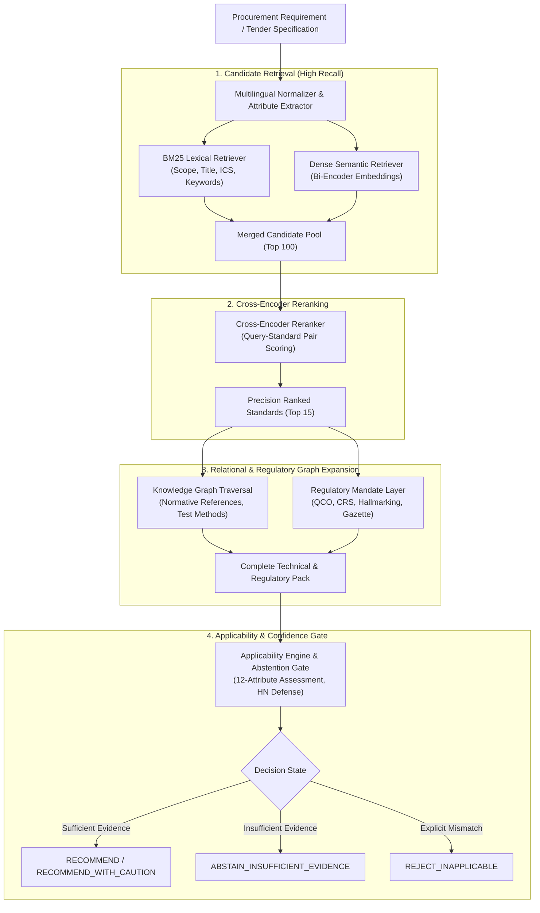

# RECOMMENDATION_ENGINE_SPEC.md — Recommendation Engine Architecture
## StandSpec AI — Evidence-Grounded Procurement Applicability Engine over a Temporal, Regulatory, and Relational Knowledge Graph

---

## 1. System Identity & Foundational Architecture

StandSpec AI is an evidence-grounded recommendation system engineered specifically for Indian Public Procurement (GeM, Railway e-Procurement IREPS, Defence CPP tenders).

> [!IMPORTANT]
> ### Core Engineering Rule: LLM is Never the Ranking Authority
> The Large Language Model (LLM) is strictly confined to **evidence synthesis, structured translation, and explanation generation**.  
> The ranking, candidate recall, applicability verification, and legal obligation determination are executed exclusively by deterministic graph traversals, cross-encoders, and regulatory rule engines.

---

## 2. The 5-Layer Knowledge Architecture

### Layer 1: Standards Knowledge Base (Frozen Collector)
- **Engine:** `src/collector.py` + `src/parser.py`.
- **Content:** Title, Designation, ICS codes, Technical Committee, Clean Scope, Foreword, Notes, and verbatim Normative References.
- **Contract:** 100% deterministic, offline cache-first, schema-validated.

### Layer 2: Relational Graph & Regulatory Mandate Layer
- **Relational Graph (`standards_graph.json`):** 15 canonical relationship types, normative clause dependencies, dual-numbering bridges, test method cross-references.
- **Regulatory Mandate Layer:** Official Ministry Quality Control Orders (QCOs), BIS Compulsory Registration Scheme (CRS), and Hallmarking statutory mandates. Tracks gazette dates, enforcement deadlines, and legal exemptions.

### Layer 3: Hybrid Retrieval & Cross-Encoder Reranker
- **Hybrid Retrieval:** Reciprocal Rank Fusion (RRF) combining BM25 lexical search over titles/scopes with dense sentence transformers.
- **Cross-Encoder Scoring:** Cross-attention over `(Tender Description, Standard Scope)` pairs, producing calibrated similarity logits without independent vector collapse.

### Layer 4: Evidence-Grounded Applicability & Verification Engine
- Evaluates technical parameters, voltage classes, material compositions, and test requirements.
- Distinguishes exact product matches from broad component standards or obsolete revisions.

### Layer 5: Structured Recommendation Output
- Structured JSON output containing standard designation, title, applicability status, legal mandate status, allied test standards, and verbatim evidence citations.

---

## 3. Two-Tier Decision States

StandSpec AI outputs two orthogonal decision classifications for every evaluated standard:

### Tier 1: System Confidence / Action State
1. **`RECOMMEND`**: High confidence, complete product specification match, clear normative evidence.
2. **`RECOMMEND_WITH_CAUTION`**: Partial match or ambiguous tender parameters; requires human engineer sign-off on specific clauses.
3. **`ABSTAIN_INSUFFICIENT_EVIDENCE`**: Tender specification lacks critical technical discrimination parameters (e.g. voltage rating, material grade); system refuses to hallucinate a recommendation.
4. **`REJECT_INAPPLICABLE`**: Standard explicitly covers different product types or incompatible duty conditions (e.g. domestic cable for underground transmission).

### Tier 2: Procurement Applicability State
1. **`MANDATORY_BY_LAW`**: Enforced under an active Government of India QCO / CRS gazette order. Non-compliance is illegal.
2. **`NORMATIVELY_MANDATORY`**: Normatively required by the primary product standard (e.g., compulsory type tests or raw material specs).
3. **`CONDITIONAL_OPTIONAL`**: Applicable only if explicitly invoked by purchaser contract options or special site conditions.
4. **`INFORMATIVE_ALLIED`**: Terminology, sampling guidelines, or related guidance codes.
5. **`SUPERSEDED_HISTORICAL`**: Older revision of an Indian Standard; valid only for legacy maintenance procurement.

---

## 4. Hard Negatives Defense (HN1 - HN8)

StandSpec AI specifically trains and evaluates rerankers against 8 categories of realistic tender traps:

| Class | Trap Type | Example Dilemma | Correct Defense |
|---|---|---|---|
| **HN1** | Part Confusion | IS 7098 Part 1 (1.1kV) vs Part 2 (3.3-33kV) | Inspect tender voltage rating |
| **HN2** | Material Mismatch | Copper vs Aluminium conductor | Check conductor material clause |
| **HN3** | Application Mismatch | Aerial bunched vs Underground armoured | Check installation environment |
| **HN4** | Superseded Revision | IS 694:1990 vs IS 694:2010 | Temporal check against tender cutoff |
| **HN5** | Vocabulary vs Spec | Terminology standard cited instead of product spec | Node type and relationship check |
| **HN6** | Allied Test Standard | Test method cited as complete product standard | Distinguish product spec from test method |
| **HN7** | Regulatory Confusion | QCO applies to primary product, not all sub-assemblies | Verify QCO product schedule scope |
| **HN8** | Cross-Domain False Positive | Ayurvedic herbal powder vs agricultural seed spec | Verify Technical Committee & ICS code |

---

## 5. Abstention & Calibration Protocol

1. **Class 3 Ambiguity Handling:** When a query falls into `CLASS_3_INSUFFICIENT_INFORMATION`, StandSpec AI triggers an intentional **Abstention Response**:
   - Lists candidate standard families.
   - States explicitly what parameter is missing from the tender text (e.g., "Specify operating voltage to distinguish IS 7098 Part 1 from Part 2").
2. **Calibration Thresholds:** Cross-encoder scores below `0.65` trigger `RECOMMEND_WITH_CAUTION`; scores below `0.40` trigger `ABSTAIN_INSUFFICIENT_EVIDENCE`.
